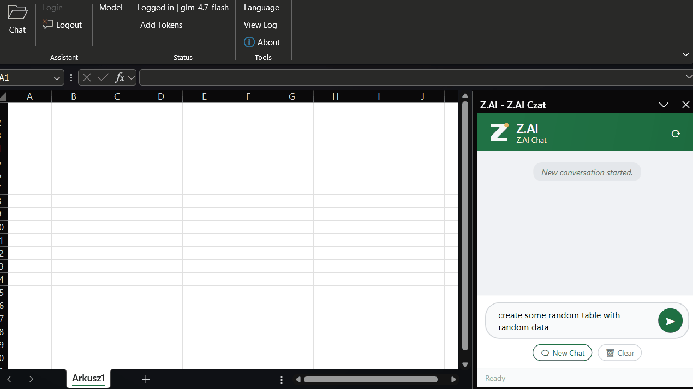

# Z.AI Excel Add-in

Dodatek do Microsoft Excel umożliwiający korzystanie z agenta AI platformy **z.ai** (Zhipu AI) bezpośrednio w arkuszu kalkulacyjnym.

**Wersja 2.0** — przepisana jako .NET COM Add-in z nowoczesnym interfejsem WPF.



## Wersje projektu

- **v2.0 (.NET COM Add-in)** — główny, rozwijany projekt w folderze `src/ZaiExcelAddin` (solution `dodatek-z-ai-opus.sln`).
- **v1.0 (VBA .xlam)** — starsza wersja w folderze `legacy`; możesz ją przebudować poleceniem `cscript build.vbs`.

## Pobierz

- [Najnowszy pakiet Excel-DNA (.xll) dla COM Add-in](https://github.com/cino893/z.ai-Unofficial-Excel-Com-Add-in-addon/releases/latest/download/ZaiExcelAddin-AddIn64-packed.xll)
- [Pełna lista wydań](https://github.com/cino893/z.ai-Unofficial-Excel-Com-Add-in-addon/releases)

## ✨ Nowości w v2.0

- **Prawdziwy panel boczny** (Custom Task Pane) — czat wyświetla się po prawej stronie Excela
- **Piękny interfejs WPF** — dymki czatu, gradient, animowane wskaźniki, logo
- **8 języków** — PL, EN, DE, FR, ES, UK, ZH, JA (auto-wykrywanie z Windowsa)
- **15 narzędzi AI** — w tym `list_charts` i `delete_chart` (naprawiony bug z pętlą wykresów)
- **Wykrywanie pętli** — AI nie powtarza tych samych operacji w nieskończoność
- **Wstążka (Ribbon)** — dedykowana zakładka Z.AI z przyciskami

## Możliwości

| Tool | Opis |
|------|------|
| `read_cell` / `write_cell` | Odczyt/zapis komórki |
| `read_range` / `write_range` | Odczyt/zapis zakresu (tablice 2D) |
| `get_sheet_info` | Informacje o arkuszu (wymiary, nagłówki) |
| `get_workbook_info` | Informacje o skoroszycie (arkusze, ścieżka) |
| `format_range` | Formatowanie (czcionka, kolory, ramki, wyrównanie, merge) |
| `insert_formula` | Wstawianie formuł Excel |
| `sort_range` | Sortowanie danych |
| `add_sheet` | Dodawanie arkusza |
| `delete_rows` / `insert_rows` | Usuwanie/wstawianie wierszy |
| `create_chart` | Tworzenie wykresów (column, bar, line, pie, scatter, area) |
| `delete_chart` | Usuwanie wykresu |
| `list_charts` | Lista wykresów na arkuszu |

## Wymagania

- Microsoft Excel 2016+ (Windows, 64-bit zalecany)
- .NET 8.0 Runtime ([pobierz](https://dotnet.microsoft.com/download/dotnet/8.0))
- Klucz API z [z.ai](https://open.z.ai/) (rejestracja darmowa)

## Budowanie

Wymagany .NET SDK 8.0+:

```powershell
cd src\ZaiExcelAddin
dotnet build -c Release
```

Wynik: `src\ZaiExcelAddin\bin\Release\net8.0-windows\publish\ZaiExcelAddin-AddIn64-packed.xll`

## Instalacja

1. Otwórz Excel
2. **Plik** → **Opcje** → **Dodatki**
3. Na dole: **Zarządzaj** → **Dodatki programu Excel** → **Przejdź**
4. Kliknij **Przeglądaj** i wskaż plik `ZaiExcelAddin-AddIn64-packed.xll`
5. Zatwierdź

Zakładka **Z.AI** pojawi się na wstążce.

## Użytkowanie

### Logowanie
Kliknij **Z.AI** → **Login** → wpisz klucz API z platformy z.ai.

### Czat z AI
Kliknij przycisk **💬 Chat** na wstążce Z.AI — otworzy się panel boczny z czatem.

Przykłady poleceń:
- "Przeczytaj dane z A1:D10"
- "Dodaj formułę SUM do E1"
- "Sformatuj nagłówki na pogrubione z niebieskim tłem"
- "Stwórz wykres kołowy z A1:B5"
- "Posortuj po kolumnie C malejąco"

### Zmiana języka
**Z.AI** → **Language** → wpisz kod: `pl`, `en`, `de`, `fr`, `es`, `uk`, `zh`, `ja`

## Struktura projektu

```
dodatek-z-ai-opus/
├── src/ZaiExcelAddin/           # .NET COM Add-in (v2.0)
│   ├── ZaiExcelAddin.csproj     # Projekt C# + ExcelDNA
│   ├── AddIn.cs                 # Punkt wejścia (IExcelAddIn)
│   ├── RibbonController.cs      # Wstążka + Custom Task Pane
│   ├── Models/
│   │   └── ChatMessage.cs
│   ├── Services/
│   │   ├── AuthService.cs       # Klucz API (rejestr Windows)
│   │   ├── ConversationService.cs # Pętla tool-calling
│   │   ├── DebugLogger.cs       # Logowanie
│   │   ├── ExcelSkillService.cs # 15 narzędzi Excel
│   │   ├── I18nService.cs       # 8 języków
│   │   └── ZaiApiService.cs     # HTTP do z.ai API
│   └── UI/
│       ├── ChatPanel.xaml        # Interfejs WPF czatu
│       ├── ChatPanel.xaml.cs
│       └── ChatPaneHost.cs       # Host WinForms dla CTP
├── *.bas, *.frm                 # Legacy VBA (v1.0)
├── build.vbs                    # Legacy: budowanie .xlam
└── README.md
```

## Architektura v2.0

```
┌──────────────┐    HTTP/JSON     ┌─────────────────┐
│   z.ai API   │◄───────────────►│  ZaiApiService   │
│   (GLM-4+)   │                 └────────┬────────┘
└──────────────┘                          │
                                ┌─────────▼────────┐
                                │ ConversationSvc   │ ← tool-calling loop
                                │ (max 15 rounds,   │   + loop detection
                                │  dedup detection)  │
                                └─────────┬────────┘
                                          │
                     ┌────────────────────┼────────────────────┐
                     │                    │                    │
              ┌──────▼──────┐    ┌───────▼──────┐    ┌───────▼──────┐
              │  ChatPanel   │    │ ExcelSkillSvc │    │  I18nService  │
              │  (WPF CTP)   │    │ (15 tools)    │    │  (8 langs)    │
              └─────────────┘    └──────────────┘    └──────────────┘
```

## Wersja Legacy (VBA)

Stara wersja VBA (.xlam) jest nadal dostępna — uruchom `cscript build.vbs` aby ją zbudować.

## Licencja

Projekt open-source. Wykorzystuje API platformy z.ai — wymagane konto i klucz API.
